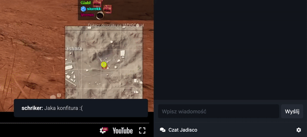

# Jarchiwum

[Online](https://jarchiwum.pl/) 

## What is this all about?

The app allows users to subscribe their favorite twitch streamers, and watch streams that they have missed.  

App simply starts with just demo state of default channels that community of jadisco.pl watch (Wonziu, DzejTH and NvidiaGeforcePL).  User then can simply add their own channels and/or remove them. Mark videos as watched and bookmarked. 

By default state will be stored in browser localStorage, but you can register simple user account so your data will be stored in firebase for syncing state between browsers you use. 

If you are a streamer yo can share link like:  https://jarchiwum.pl/your-twitch-name and that will automatically  add your channel to users favorites. 

*Important note:* chat on some video page is made by [tr0lit](https://tr0l.it/) [poorchat](https://www.poorchat.net/)

## Update 27.01.2020 

### Added
* Poorchat authentication
* Ability to post short messages/comments to video

## Update 07.11.2019 

### Fixed
* Mobile version improvements
* Chat performance 

### Added
* Twemoji
* Action message
* Button to change player from YouTube to Facebook
* Moments chart from stream
* Support for other streamers with poorchat

## What I use?
App is build with:
* [Vue](https://vuejs.org/) 
* [Vuex](https://vuex.vuejs.org/) 
* [Sass](https://sass-lang.com/) 
* [Firebase](https://firebase.google.com/) 

## Installation
You can just clone repository files and run to install all dependencies:

`npm install`

After that just run to start server:

`npm run serve`

To build project:

`npm run build`

*All project files are located in ./src/*